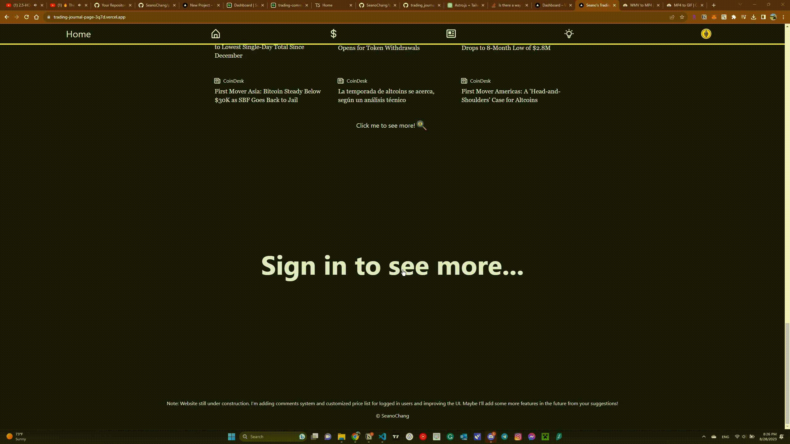
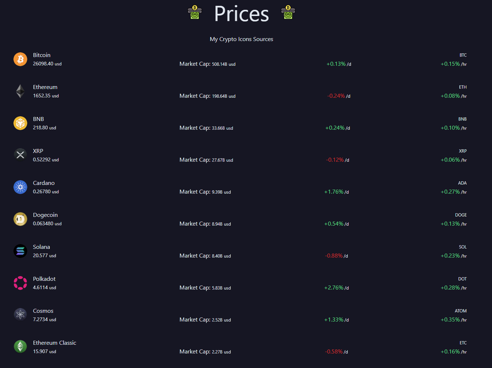
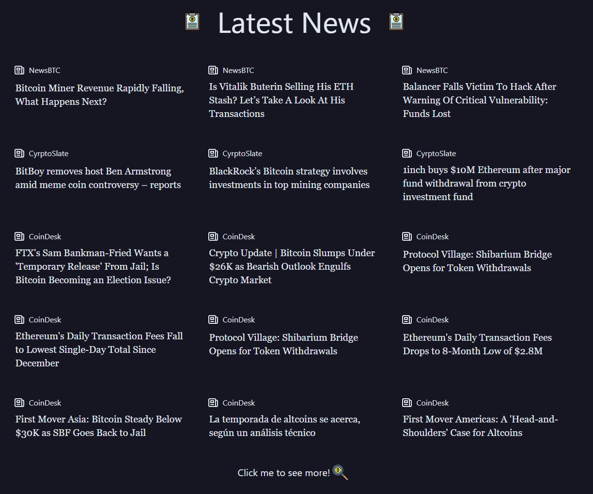
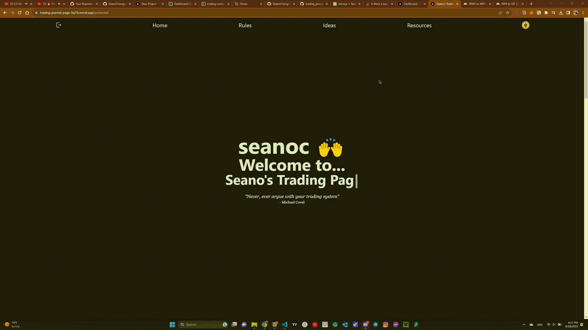
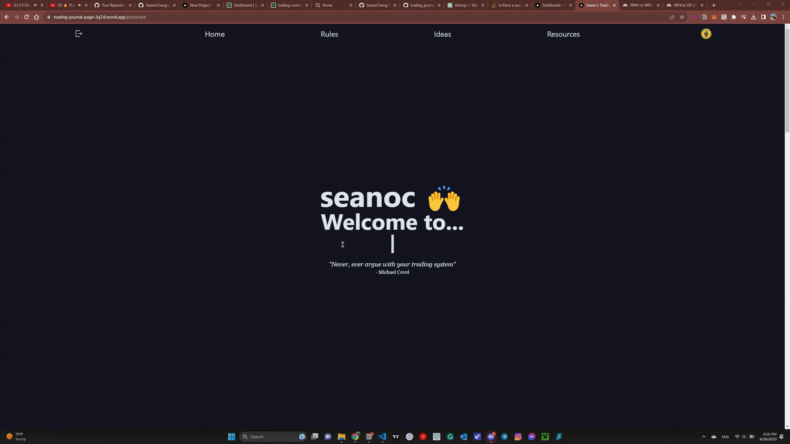

# Trading Journal Page

Welcome to the Trading Journal Page project! This full-stack application is designed to share me tracking my trading journey, record insights, and share my progress with close friends. The project utilizes a combination of technologies to create a comprehensive platform for sharing my trading experiences.

## Features

- **Personal Trading Journal**: The application allows me to maintain a trading journal where I can document and share my trading activities, insights, and observations.

- **User Authentication**: NextAuth.js is integrated to provide user authentication, allowing secure access to the journal using Discord, Github, and Google login for accessing my ideas.

- **Animated User Interface**: Framer Motion is used to add smooth animations and transitions to the user interface, enhancing the user experience.

- **Database Integration**: The backend integrates with Supabase, which uses PostgreSQL as the underlying database. Prisma is used to facilitate database operations and interactions.

- **API Integration**: The application fetches cryptocurrency prices from Coin Market Cap and aggregates news from NewsBTC, Cryptoslate, and CoinDesk using a small scraping program.

## Getting Started

1. **Clone the Repository**: Start by cloning this repository to your local machine:

   ```bash
   git clone https://github.com/SeanoChang/trading_journal_page.git
   ```

2. **Navigate to the Project Directory**: Move into the project directory:

   ```bash
   cd trading_journal_page
   ```

3. **Install Dependencies**: Install the required dependencies using npm:

   ```bash
   npm install
   ```

4. **Configure Environment Variables**: Create `.env` files based on the provided examples or guidelines from the respective frameworks.

5. **Run the Application**: Start the server:

   ```bash
   npm run dev
   ```

6. **Access the Application**: Open your browser and navigate to `http://localhost:3000` to explore and use the trading journal application.

## Showcase

Here are some key features of the Trading Journal Page application:

### User Registration and Authentication



The application utilizes NextAuth.js for user authentication. Users can sign up and log in to securely access their trading journal.

### Track Trading Ideas


Users can create, edit, and track their trading ideas, insights, and observations in the journal.

### Real-Time Price Tracking



The application provides real-time cryptocurrency prices fetched from Coin Market Cap to help users stay updated with the latest market data.

### News Aggregation



Stay informed about the latest developments in the cryptocurrency world through news aggregation from NewsBTC, Cryptoslate, and CoinDesk.

### Smooth Animations with Framer Motion


The user interface is enhanced with Framer Motion animations, including children delay render, click effects, and in-view transitions.


The lists of price and news are touched with children delayed rendering.

### Light and Dark Mode



Users can switch between light and dark modes to customize their viewing experience.

### Responsive Design


The application is designed to work seamlessly on various devices, ensuring a consistent user experience.

### Typewriter Effect



Engage users with the typewriter effect, adding a dynamic touch to text content.

## Usage

1. **User Registration**: Sign up using NextAuth.js to create an account and gain access to the trading journal.

2. **Create Journal Entries**: Use the journal interface to document your trading activities, insights, and observations.

3. **Fetch Prices and News**: The application automatically fetches cryptocurrency prices from Coin Market Cap and aggregates news from various sources.

4. **Share Insights**: Share your trading insights with your close friends by using the features provided by the application.

## Contributions

Contributions to this project are welcome! If you have ideas for improvements, additional features, or suggestions for enhancing the user experience, feel free to submit a pull request or open an issue.
